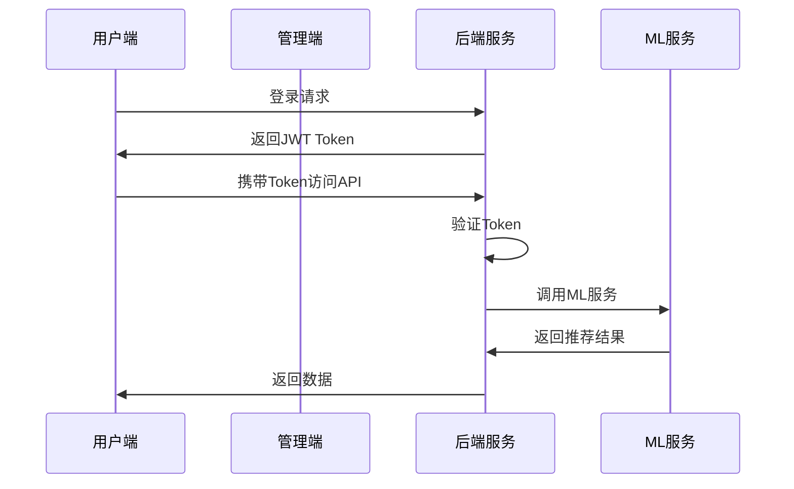

# 智能饮食推荐系统 - 前后端完整集成方案

## 📋 系统架构概览

### 🏗️ 整体架构
```
┌─────────────────────────────────────────────────────────────┐
│                    智能饮食推荐系统                          │
├─────────────────────────────────────────────────────────────┤
│  用户端前端        │  管理员前端       │  后端服务           │
│  (React)          │  (Vue2)          │  (Spring Boot)      │
│  localhost:3000   │  localhost:81    │  localhost:8080     │
├─────────────────────────────────────────────────────────────┤
│                    机器学习服务                              │
│                    (Python FastAPI)                        │
│                    localhost:8001                          │
├─────────────────────────────────────────────────────────────┤
│  MySQL            │  MongoDB         │  Neo4j              │
│  localhost:3306   │  localhost:27017 │  localhost:7687     │
└─────────────────────────────────────────────────────────────┘
```

## 🚀 快速启动指南

### 1. 使用统一启动脚本
```bash
# Windows系统
./start_all_services.bat

# 或者手动启动各个服务
```

### 2. 手动启动各服务

#### 后端服务 (端口: 8080)
```bash
cd SDR_System
java -jar SDR_System-admin.jar
```

#### 机器学习服务 (端口: 8001)
```bash
cd SDR_System-ml
python start_ml_service.py
```

#### 管理员前端 (端口: 81)
```bash
cd SDR_System-ui
npm run dev
```

#### 用户端前端 (端口: 3000)
```bash
cd sdr-user-frontend
npm start
```

## 🔗 服务间通信配置

### API接口统一规范

#### 1. 请求格式
```javascript
// 请求头
{
  "Content-Type": "application/json",
  "Authorization": "Bearer <token>",
  "X-Request-ID": "<request_id>"
}

// 若依框架响应格式
{
  "code": 200,
  "msg": "操作成功",
  "data": { ... }
}
```

#### 2. 接口路径规范
```
/api/admin/*    - 管理员接口
/api/user/*     - 用户接口  
/api/public/*   - 公开接口
/api/ml/*       - ML服务接口
```

### 跨域配置

#### 后端CORS配置
```java
@CrossOrigin(origins = {
    "http://localhost:3000",  // 用户端
    "http://localhost:81"     // 管理端
}, allowCredentials = "true")
```

#### 前端代理配置

**用户端 (React)**
```javascript
// vite.config.js
server: {
  port: 3000,
  proxy: {
    '/api': {
      target: 'http://localhost:8080',
      changeOrigin: true
    }
  }
}
```

**管理端 (Vue2)**
```javascript
// vue.config.js
devServer: {
  port: 81,
  proxy: {
    '/dev-api': {
      target: 'http://localhost:8080',
      changeOrigin: true,
      pathRewrite: {
        '^/dev-api': ''
      }
    }
  }
}
```

## 🛡️ 安全与认证

### JWT认证流程


### 权限控制
- **用户端**: 只能访问自己的数据
- **管理端**: 可以管理所有用户数据
- **API权限**: 基于角色的访问控制

## 📊 数据流集成

### 用户端数据流
```javascript
// 用户端API调用示例
import { dashboardApi } from '../services/api';

// 获取仪表板数据
const dashboardData = await dashboardApi.getDashboardData();

// 添加饮食记录
const record = await dietRecordApi.addRecord({
  foodName: '苹果',
  amount: 100,
  mealType: 'breakfast'
});
```

### 管理端数据流
```javascript
// 管理端API调用示例
import request from '@/utils/request'

// 获取用户列表
export function listUser(query) {
  return request({
    url: '/system/user/list',
    method: 'get',
    params: query
  })
}
```

## 🔧 系统监控与健康检查

### 健康检查端点
```
后端服务: http://localhost:8080/actuator/health
ML服务:   http://localhost:8001/health
```

### 系统状态监控
- **连接状态管理**: 自动检测网络连接
- **服务健康检查**: 定期检查各服务状态
- **错误重试机制**: 自动重试失败的请求
- **缓存管理**: API响应缓存优化

## 🎯 功能集成点

### 1. 用户认证集成
- 统一登录页面
- Token自动刷新
- 权限路由守卫

### 2. 数据同步集成
- 实时数据更新
- 离线数据缓存
- 数据一致性保证

### 3. AI推荐集成
- 食物识别API
- 个性化推荐
- 模型训练状态同步

### 4. 文件上传集成
- 统一文件上传接口
- 图片压缩优化
- 进度显示

## 🔍 故障排查

### 常见问题

#### 1. 端口冲突
```bash
# 检查端口占用
netstat -ano | findstr :3000
netstat -ano | findstr :8080
netstat -ano | findstr :8001
netstat -ano | findstr :81
```

#### 2. CORS错误
- 检查后端CORS配置
- 确认前端代理配置
- 验证请求头设置

#### 3. 认证失败
- 检查Token是否正确
- 验证Token是否过期
- 确认权限配置

#### 4. API调用失败
- 检查网络连接
- 验证API地址
- 查看控制台错误日志

### 调试工具

#### 1. 浏览器开发者工具
- Network面板查看API请求
- Console面板查看错误日志
- Application面板查看Token存储

#### 2. 后端日志
```bash
# 查看后端日志
tail -f logs/sys-info.log
```

#### 3. ML服务日志
```bash
# 查看ML服务日志
tail -f SDR_System-ml/logs/ml_service.log
```

## 📈 性能优化

### 前端优化
- **代码分割**: 路由级别的懒加载
- **API缓存**: 减少重复请求
- **图片优化**: 压缩和懒加载
- **Bundle分析**: 减少包体积

### 后端优化
- **连接池**: 数据库连接优化
- **缓存策略**: Redis缓存热点数据
- **异步处理**: 耗时操作异步化
- **SQL优化**: 查询性能优化

### 系统监控
- **响应时间**: API响应时间监控
- **错误率**: 系统错误率统计
- **资源使用**: CPU、内存监控
- **用户行为**: 用户操作分析

## 🚀 部署方案

### 开发环境
```bash
# 启动所有服务
./start_all_services.bat
```

### 生产环境
```bash
# Docker部署
docker-compose up -d

# 或使用Nginx反向代理
nginx -s reload
```

### 环境配置

#### 开发环境配置
```json
{
  "backend": "http://localhost:8080",
  "ml_service": "http://localhost:8001",
  "admin_frontend": "http://localhost:81",
  "user_frontend": "http://localhost:3000"
}
```

#### 生产环境配置
```json
{
  "backend": "https://api.yourdomain.com",
  "ml_service": "https://ml.yourdomain.com",
  "admin_frontend": "https://admin.yourdomain.com",
  "user_frontend": "https://app.yourdomain.com"
}
```

## 📝 API文档

### 在线文档地址
- **Swagger UI**: http://localhost:8080/swagger-ui/
- **ML API文档**: http://localhost:8001/docs

### 主要API接口

#### 用户端API
```
GET  /api/user/diet/dashboard     - 获取仪表板数据
POST /api/user/diet/records       - 添加饮食记录
GET  /api/user/diet/statistics    - 获取统计数据
POST /api/user/diet/recognize     - AI食物识别
```

#### 管理端API
```
GET  /diet/record/list           - 获取饮食记录列表
POST /diet/record               - 新增饮食记录
PUT  /diet/record               - 修改饮食记录
DELETE /diet/record/{id}        - 删除饮食记录
```

#### ML服务API
```
POST /recommend                 - 获取推荐
POST /train                    - 训练模型
GET  /health                   - 健康检查
GET  /status                   - 服务状态
```

## ✅ 集成验证清单

### 基础功能验证
- [ ] 所有服务正常启动
- [ ] 用户可以正常登录
- [ ] API接口调用成功
- [ ] 数据正确显示

### 权限验证
- [ ] 用户只能访问自己的数据
- [ ] 管理员可以管理所有数据
- [ ] 未授权访问被正确拦截

### 功能集成验证
- [ ] 饮食记录增删改查
- [ ] AI食物识别功能
- [ ] 个性化推荐功能
- [ ] 数据统计分析

### 性能验证
- [ ] API响应时间 < 2秒
- [ ] 页面加载时间 < 3秒
- [ ] 无内存泄漏
- [ ] 错误处理正确

## 🎉 集成完成

恭喜！您的智能饮食推荐系统前后端集成已完成。系统现在具备：

✅ **完整的用户端体验** - React现代化界面
✅ **强大的管理功能** - Vue2管理后台
✅ **稳定的后端服务** - Spring Boot API
✅ **智能推荐引擎** - Python ML服务
✅ **统一的认证授权** - JWT安全机制
✅ **实时监控预警** - 系统健康检查
✅ **优雅的错误处理** - 用户友好提示

系统已准备好为用户提供个性化的健康饮食管理服务！
