# 智能健康饮食推荐系统 - Mermaid模块图

## 📋 目录
- [1. 总体系统架构图](#1-总体系统架构图)
- [2. 前端应用模块图](#2-前端应用模块图)
- [3. 后端服务模块图](#3-后端服务模块图)
- [4. 数据库架构图](#4-数据库架构图)
- [5. AI智能推荐模块图](#5-ai智能推荐模块图)
- [6. 用户端功能模块图](#6-用户端功能模块图)
- [7. 管理端功能模块图](#7-管理端功能模块图)
- [8. 核心业务流程图](#8-核心业务流程图)
- [9. 数据流转图](#9-数据流转图)
- [10. ML算法模块图](#10-ml算法模块图)

---

## 1. 总体系统架构图

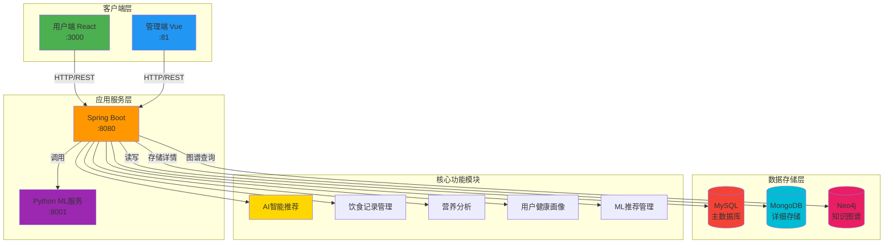

---

## 2. 前端应用模块图

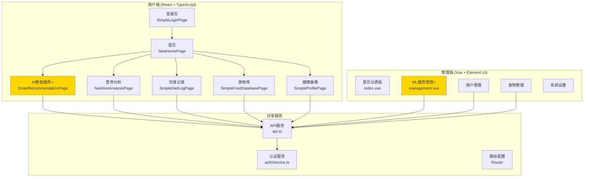

---

## 3. 后端服务模块图

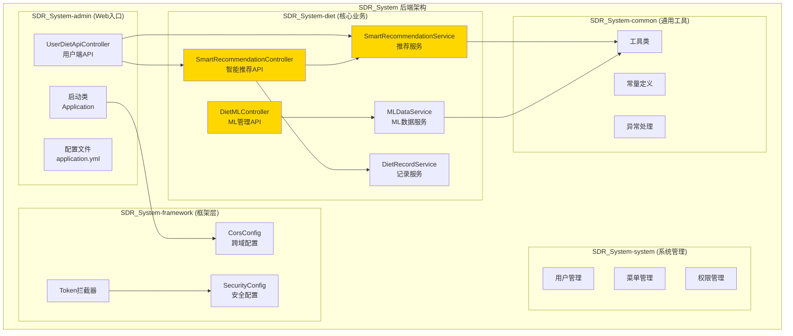

---

## 4. 数据库架构图

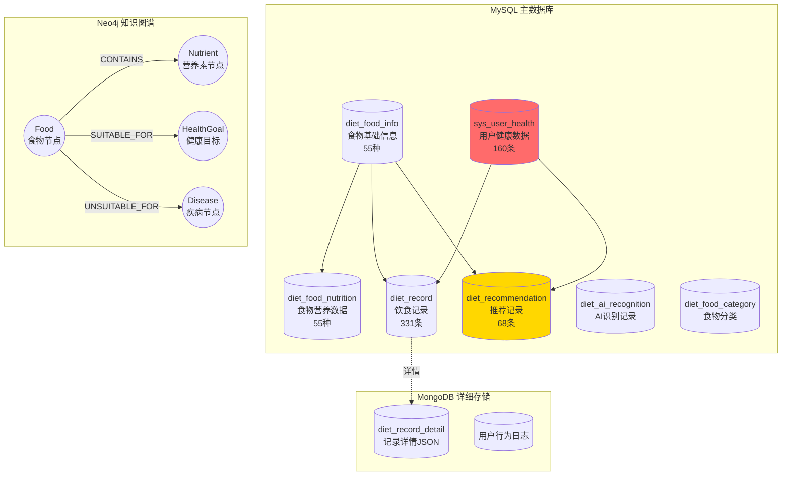

---

## 5. AI智能推荐模块图

```mermaid
graph LR
    subgraph "用户输入"
        A[用户ID<br/>餐次类型]
    end
    
    subgraph "步骤1: 健康数据获取"
        B1[查询用户健康数据]
        B2[BMI: 体重指数]
        B3[BMR: 基础代谢率]
        B4[营养目标]
        B5[饮食偏好]
        B6[不喜欢食材]
    end
    
    subgraph "步骤2: 营养目标计算"
        C1[calculate_meal_nutrition_target]
        C2[早餐30%]
        C3[午餐40%]
        C4[晚餐30%]
        C5[加餐10%]
    end
    
    subgraph "步骤3: 候选食物查询"
        D1[diet_food_info]
        D2[diet_food_nutrition]
        D3[status='0'<br/>calories>0]
    end
    
    subgraph "步骤4: 偏好过滤"
        E1[排除不喜欢食材]
        E2[过敏原过滤]
        E3[慢性病规则]
    end
    
    subgraph "步骤5: 营养匹配评分"
        F1[calculate_nutrition_match_score]
        F2[热量评分 40%]
        F3[蛋白质评分 25%]
        F4[碳水评分 20%]
        F5[脂肪评分 15%]
    end
    
    subgraph "步骤6: 历史反馈加权"
        G1[查询历史推荐]
        G2[用户评分]
        G3[营养70%+历史30%]
    end
    
    subgraph "步骤7: 排序输出"
        H1[按final_score降序]
        H2[返回TOP 10]
        H3[推荐结果展示]
    end
    
    A --> B1
    B1 --> B2 & B3 & B4 & B5 & B6
    B2 & B3 & B4 --> C1
    C1 --> C2 & C3 & C4 & C5
    C2 & C3 & C4 & C5 --> D1
    D1 --> D2
    D2 --> D3
    D3 --> E1
    E1 --> E2 --> E3
    E3 --> F1
    F1 --> F2 & F3 & F4 & F5
    F2 & F3 & F4 & F5 --> G1
    G1 --> G2 --> G3
    G3 --> H1 --> H2 --> H3
    
    style A fill:#4CAF50
    style C1 fill:#FFD700
    style F1 fill:#FFD700
    style H3 fill:#FF6B6B
```

---

## 6. 用户端功能模块图

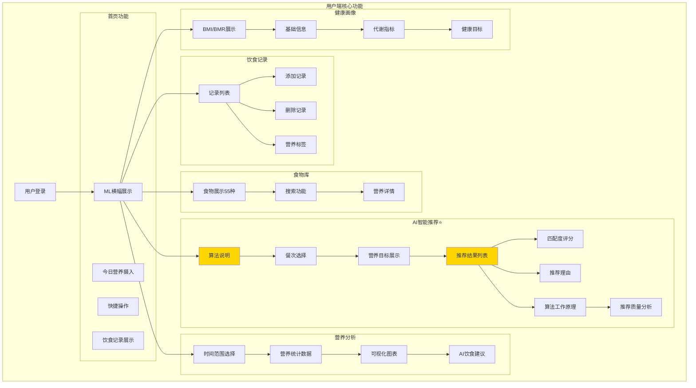

---

## 7. 管理端功能模块图

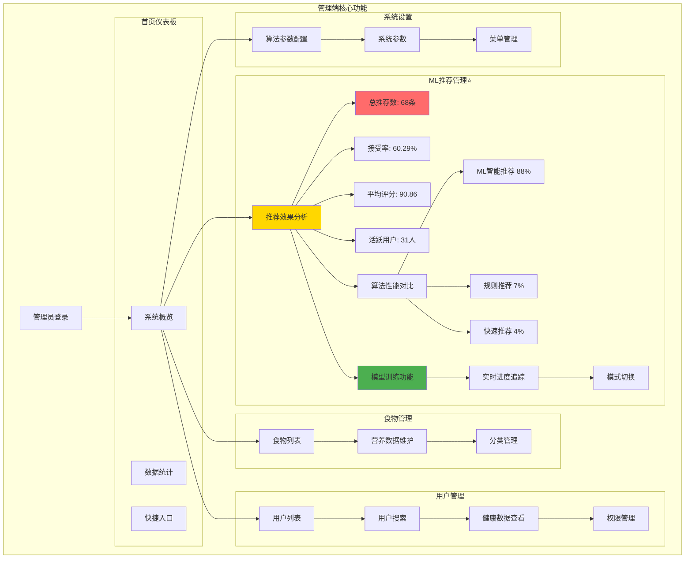

---

## 8. 核心业务流程图

### 8.1 智能推荐业务流程（紧凑版）

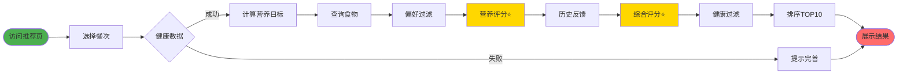

### 8.1.1 智能推荐业务流程（分组版）

```mermaid
flowchart TD
    Start([用户访问AI推荐页面]) --> Step1[选择餐次]
    
    subgraph 准备阶段
        Step1 --> Step2{获取健康数据}
        Step2 -->|成功| Step3[计算营养目标]
        Step2 -->|失败| Error1[提示完善]
    end
    
    subgraph 候选筛选
        Step3 --> Step4[查询55种食物]
        Step4 --> Step5[偏好过滤]
    end
    
    subgraph 评分计算⭐
        Step5 --> Step6[营养评分<br/>四维算法]
        Step6 --> Step7[查询历史]
        Step7 --> Step8[综合评分<br/>70%+30%]
    end
    
    subgraph 输出生成
        Step8 --> Step9[健康规则过滤]
        Step9 --> Step10[排序TOP10]
        Step10 --> Step11[生成理由+份量]
    end
    
    Step11 --> End([展示结果])
    Error1 --> End
    
    style Start fill:#4CAF50
    style Step6 fill:#FFD700
    style Step8 fill:#FFD700
    style End fill:#FF6B6B
```

### 8.1.2 智能推荐核心算法（极简版）


### 8.2 饮食记录业务流程（紧凑版）

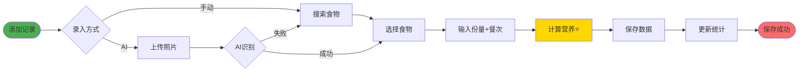

### 8.2.1 饮食记录业务流程（分组版）

```mermaid
flowchart TD
    Start([用户添加记录])
    
    subgraph 食物识别
        Start --> Step1{录入方式}
        Step1 -->|手动| Step2[搜索选择]
        Step1 -->|AI识别| Step3[上传照片]
        Step3 --> Step4{识别结果}
        Step4 -->|成功| Step5[确认食物]
        Step4 -->|失败| Step2
        Step2 --> Step5
    end
    
    subgraph 数据录入
        Step5 --> Step6[输入份量]
        Step6 --> Step7[选择餐次]
    end
    
    subgraph 营养计算⭐
        Step7 --> Step8[自动计算营养素]
    end
    
    subgraph 数据存储
        Step8 --> Step9[MySQL主表]
        Step9 --> Step10[MongoDB详情]
        Step10 --> Step11[更新统计]
    end
    
    Step11 --> End([完成])
    
    style Start fill:#4CAF50
    style Step8 fill:#FFD700
    style End fill:#FF6B6B
```

### 8.3 ML模型训练流程（紧凑版）

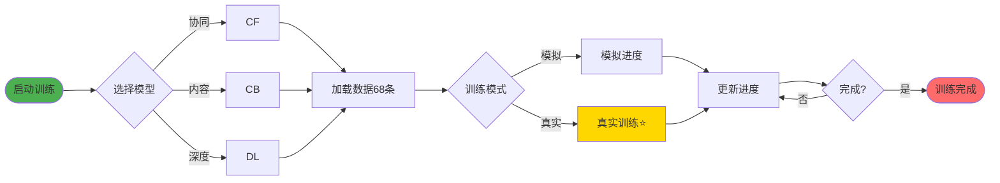

### 8.3.1 ML模型训练流程（分组版）

```mermaid
flowchart TD
    Start([管理员启动训练])
    
    subgraph 模型选择
        Start --> Step1[选择模型类型]
        Step1 --> Step2{模型}
        Step2 -->|协同过滤| M1[CF]
        Step2 -->|内容推荐| M2[CB]
        Step2 -->|深度学习| M3[DL]
    end
    
    subgraph 数据准备
        M1 & M2 & M3 --> Step3[加载68条记录]
    end
    
    subgraph 训练执行⭐
        Step3 --> Step4{模式}
        Step4 -->|模拟| Step5[模拟进度]
        Step4 -->|真实| Step6[实际训练]
        Step5 & Step6 --> Step7[实时更新]
        Step7 --> Step8{完成?}
        Step8 -->|否| Step7
    end
    
    subgraph 结果保存
        Step8 -->|是| Step9[保存记录]
        Step9 --> Step10[更新状态]
    end
    
    Step10 --> End([完成])
    
    style Start fill:#4CAF50
    style Step6 fill:#FFD700
    style End fill:#FF6B6B
```

---

## 9. 数据流转图

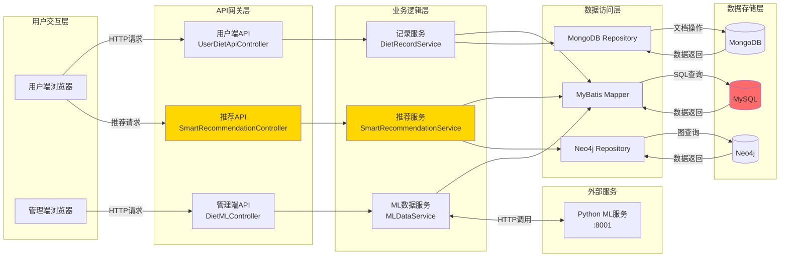

---

## 10. ML算法模块图

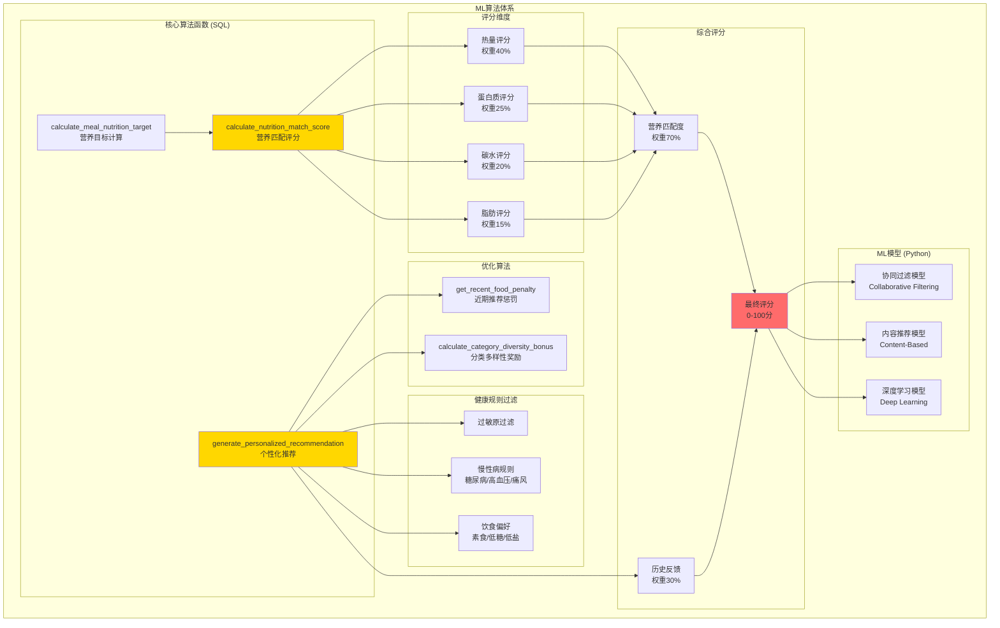

---

## 📊 图表说明

### 流程图版本对比

每个核心业务流程提供了**3个版本**，您可以根据使用场景选择：

| 版本 | 特点 | 适用场景 | 推荐度 |
|------|------|----------|--------|
| **紧凑版 (LR)** | 横向布局，节点文字精简 | PPT展示、宽屏显示、快速理解 | ⭐⭐⭐⭐⭐ |
| **分组版 (TD)** | 使用subgraph分阶段 | 详细文档、技术讨论、逻辑清晰 | ⭐⭐⭐⭐ |
| **极简版 (LR)** | 只保留核心步骤 | 答辩演示、概览说明、时间紧张 | ⭐⭐⭐ |

**推荐使用**：
- **答辩PPT**：极简版或紧凑版
- **答辩讲解**：紧凑版（边讲边指）
- **文档说明**：分组版（结构清晰）
- **快速预览**：极简版

### 优化效果对比

**原版本问题**：
- ❌ 节点文字过长（如"计算个性化营养目标<br/>基于BMR/BMI"）
- ❌ 纵向布局过长，不适合宽屏
- ❌ 13个步骤节点，视觉拥挤

**紧凑版优化**：
- ✅ 文字精简50%（如"计算营养目标"）
- ✅ 横向布局，适合宽屏展示
- ✅ 保留核心逻辑，视觉清爽

**分组版优化**：
- ✅ 按业务阶段分组（准备→筛选→评分→输出）
- ✅ 层次分明，便于理解
- ✅ 重点模块标注⭐

**极简版优化**：
- ✅ 只保留7个核心节点
- ✅ 适合快速讲解（30秒内）
- ✅ 突出核心算法

### 使用说明
1. 将以上Mermaid代码复制到支持Mermaid的Markdown编辑器中查看
2. 推荐工具：
   - **Typora** - 最佳体验，自动渲染
   - **VS Code** - 安装 "Markdown Preview Mermaid Support" 插件
   - **在线工具** - https://mermaid.live/ （可导出PNG/SVG）
   - **GitHub** - 直接支持Mermaid语法，push后自动渲染

### 图表类型
- `graph TB/LR`: 流程图 (上下/左右布局)
- `flowchart TD/LR`: 增强流程图（推荐使用）
- `subgraph`: 子图模块分组

### 颜色说明
- 🟡 黄色 (#FFD700): 核心/重点模块（算法、计算）
- 🔴 红色 (#FF6B6B): 数据库/输出结果
- 🟢 绿色 (#4CAF50): 起始/用户输入
- 🔵 蓝色 (#2196F3): 一般模块
- 🟣 紫色 (#9C27B0): AI/ML服务

### 导出为图片
在 https://mermaid.live/ 中：
1. 粘贴代码到左侧编辑器
2. 右侧实时预览
3. 点击 **Actions** → **Download PNG** 或 **Download SVG**
4. 插入到PPT/Word中使用

---

**创建日期**: 2025-10-17  
**更新日期**: 2025-10-17  
**版本**: v1.1 (优化版)  
**适用范围**: 毕业设计答辩、系统文档、技术汇报
