### 3.4 数据库设计

#### 3.4.1 实体属性图设计
根据指导老师的要求，这里将系统中各个核心业务实体及其属性分别列出，不再展示相互之间的关联关系。

**(1) 用户实体**
用户实体包括用户ID、用户名、登录密码、昵称、手机号、性别、头像路径、状态和创建时间等属性，如图 3.x 所示。
（图 3.x 用户实体属性图）

**(2) 健康档案实体**
健康档案实体包括档案ID、用户ID、身高、体重、年龄、目标体重、基础代谢率、每日推荐热量、是否糖尿病、是否高血压、是否痛风和更新时间等属性，如图 3.x 所示。
（图 3.x 健康档案实体属性图）

**(3) 食物分类实体**
食物分类实体包括分类ID、分类名称、排序号、状态和创建时间等属性，如图 3.x 所示。
（图 3.x 食物分类实体属性图）

**(4) 食物信息实体**
食物信息实体包括食物ID、食物名称、分类ID、食物编码、计量单位、标准重量、数据来源和创建时间等属性，如图 3.x 所示。
（图 3.x 食物信息实体属性图）

**(5) 食物营养信息实体**
食物营养信息实体包括营养ID、食物ID、热量、蛋白质、脂肪、碳水化合物、膳食纤维、钠和胆固醇等属性，如图 3.x 所示。
（图 3.x 食物营养信息实体属性图）

**(6) 饮食记录实体**
饮食记录实体包括记录ID、用户ID、餐次类型、总热量、总蛋白质、总脂肪、总碳水、记录日期和创建时间等属性，如图 3.x 所示。
（图 3.x 饮食记录实体属性图）

**(7) 推荐记录实体**
推荐记录实体包括推荐ID、用户ID、推荐日期、餐次类型、推荐食物、算法类型、推荐评分和是否采纳等属性，如图 3.x 所示。
（图 3.x 推荐记录实体属性图）

**(8) 健康目标实体**
健康目标实体包括目标ID、用户ID、目标类型、目标名称、目标值、当前值、完成百分比、状态和创建时间等属性，如图 3.x 所示。
（图 3.x 健康目标实体属性图）

**(9) 饮食打卡实体**
饮食打卡实体包括打卡ID、用户ID、打卡日期、饮食摘要、总热量、心情、打卡心得和创建时间等属性，如图 3.x 所示。
（图 3.x 饮食打卡实体属性图）

**(10) 社区动态实体**
社区动态实体包括动态ID、用户ID、正文内容、图片链接、点赞数、评论数、删除标记和创建时间等属性，如图 3.x 所示。
（图 3.x 社区动态实体属性图）

**(11) 科普资讯实体**
科普资讯实体包括文章ID、标题、作者、封面图、正文内容、浏览次数、发布状态和创建时间等属性，如图 3.x 所示。
（图 3.x 科普资讯实体属性图）

**(12) 收藏记录实体**
收藏记录实体包括收藏ID、用户ID、收藏类型、目标ID、目标名称、目标描述、目标图片和创建时间等属性，如图 3.x 所示。
（图 3.x 收藏记录实体属性图）

---

### 附：各个实体的属性图PlantUML代码

> **使用方法**：将每段 `@startuml ... @enduml` 之间的代码复制到 [PlantUML在线编辑器](https://www.plantuml.com/plantuml/uml/) 中，点击 Submit 即可生成图片并下载。
>
> **中文字体说明**：使用 `@startuml` 原生语法，中文可正常显示，不会出现方块。

---

**1. 用户实体属性图**
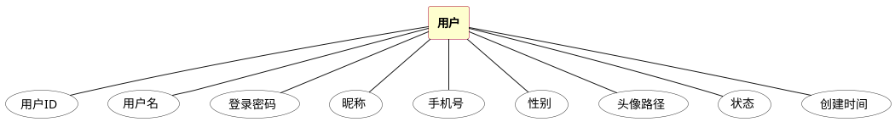

---

**2. 健康档案实体属性图**
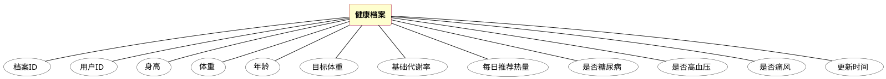

---

**3. 食物分类实体属性图**
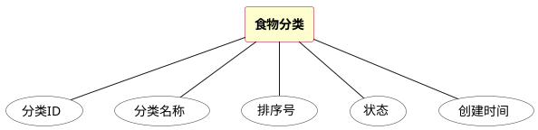

---

**4. 食物信息实体属性图**
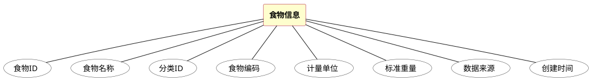

---

**5. 食物营养信息实体属性图**
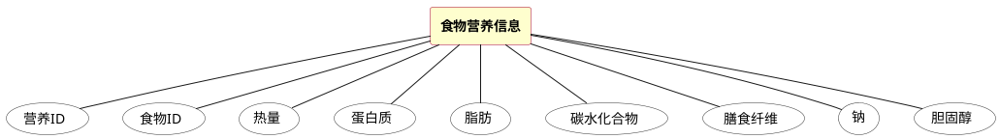

---

**6. 饮食记录实体属性图**
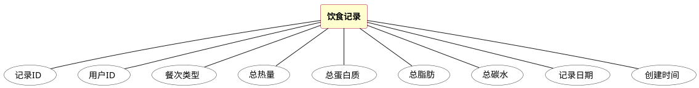

---

**7. 推荐记录实体属性图**
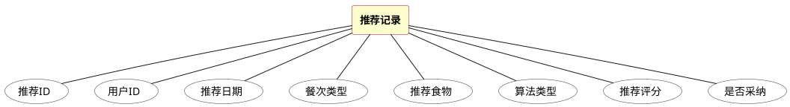

---

**8. 健康目标实体属性图**
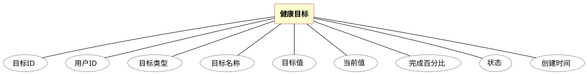

---

**9. 饮食打卡实体属性图**
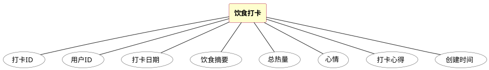

---

**10. 社区动态实体属性图**
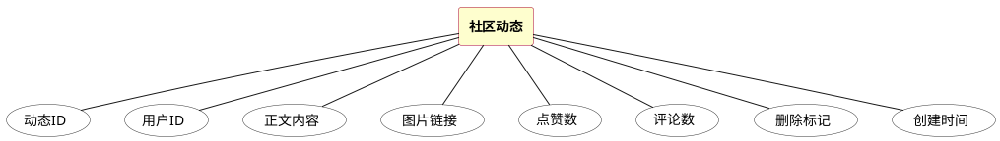

---

**11. 科普资讯实体属性图**
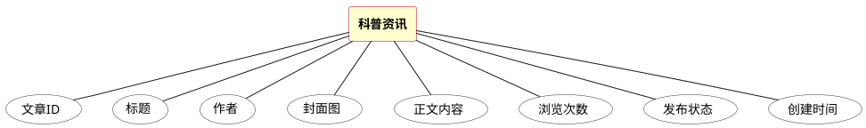

---

**12. 收藏记录实体属性图**
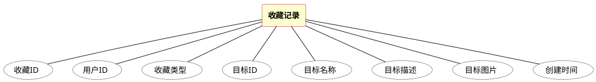
