# 毕业论文全部图表 PlantUML 源码

> **使用方法**：将每段代码复制到 [PlantUML在线编辑器](https://www.plantuml.com/plantuml/uml/) 中，点击 Submit 即可生成图片并下载。

---

## 图2.1 普通用户用例图

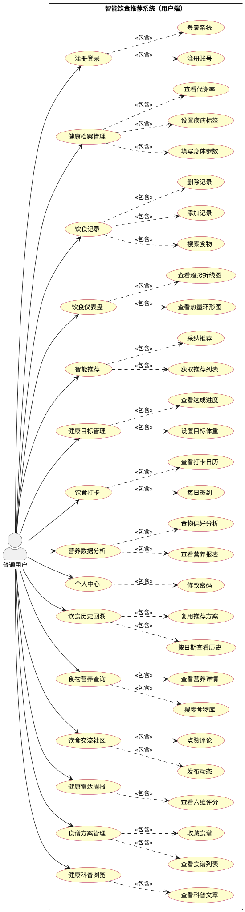

---

## 图2.2 管理员用例图

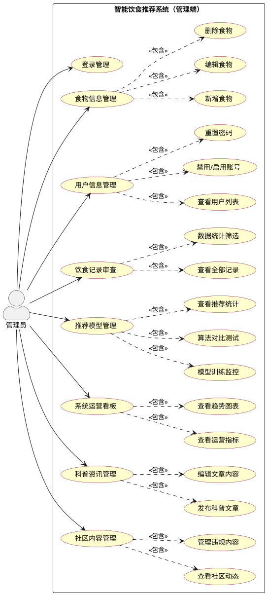

---

## 图3.1 系统功能模块图

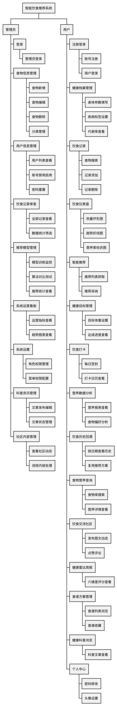

---

## 图3.2 注册登录流程图

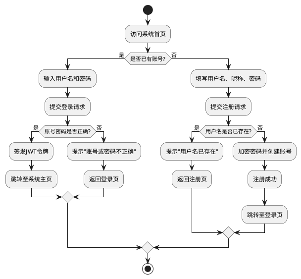

---

## 图3.3 健康档案建立流程图

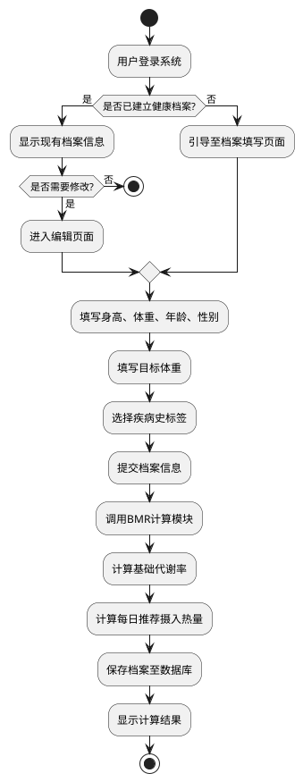

---

## 图3.4 每日饮食记录流程图

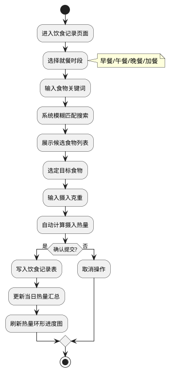

---

## 图3.5 智能推荐流程图

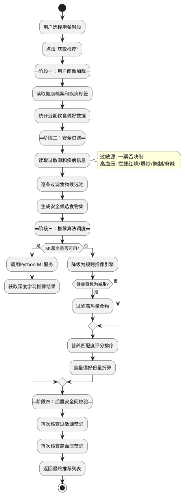

---

## 图3.6 食物信息维护流程图

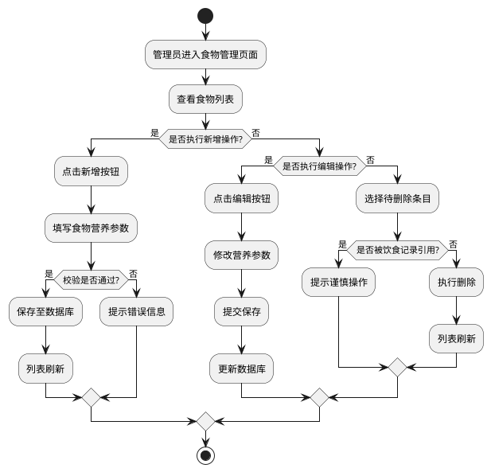

---

## 图3.7 健康目标管理流程图

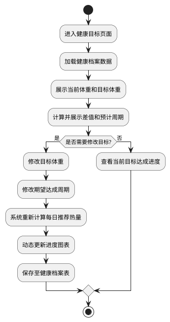

---

## 图3.8 饮食仪表盘展示流程图

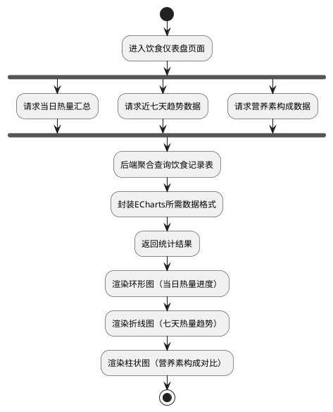

---

## 图3.9 营养数据分析流程图

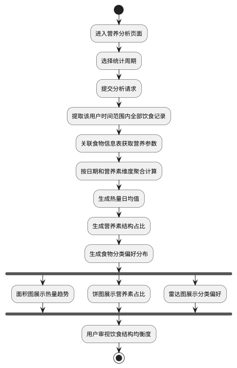

---

## 图3.10 饮食打卡签到流程图

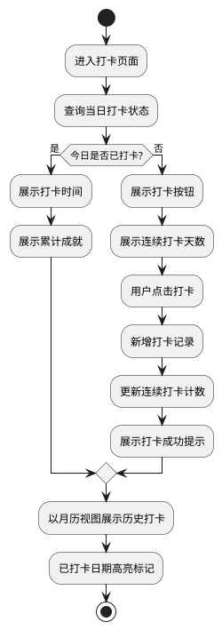

---

## 图3.11 系统权限管理流程图

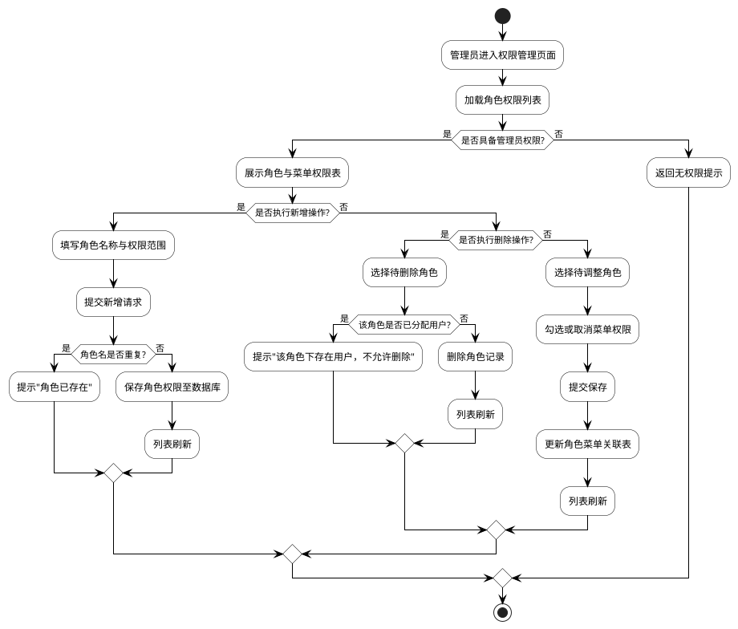

---

## 图3.12 用户与健康档案关系E-R图

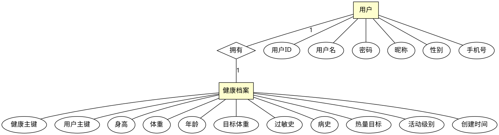

---

## 图3.13 用户与饮食记录关系E-R图

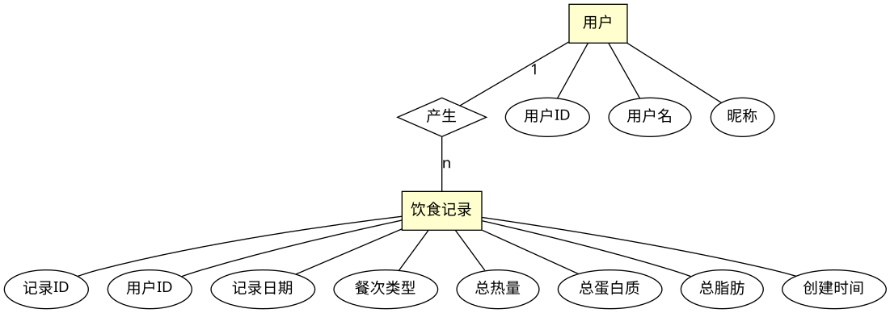

---

## 图3.14 饮食记录与食物信息关系E-R图

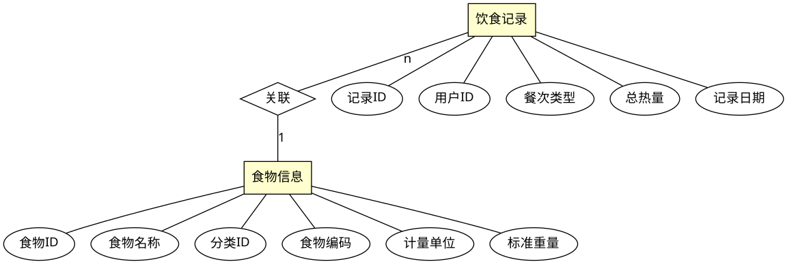

---

## 图3.15 用户与推荐记录关系E-R图

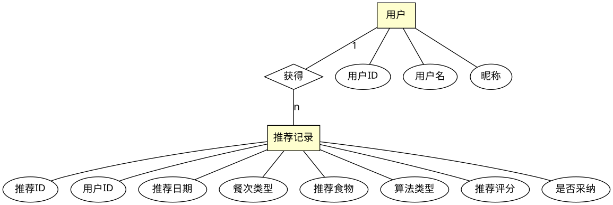

---

## 图3.16 食物分类与食物信息关系E-R图

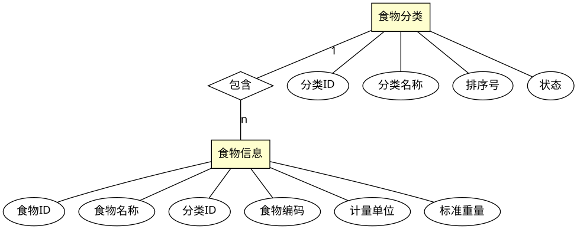

---

## 图3.17 食物信息与营养信息关系E-R图

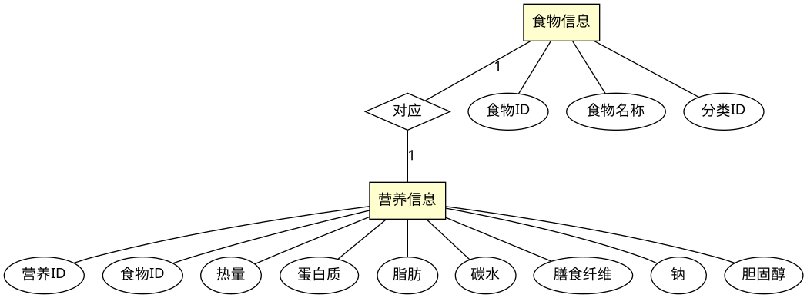

---

## 图3.18 用户与健康目标关系E-R图

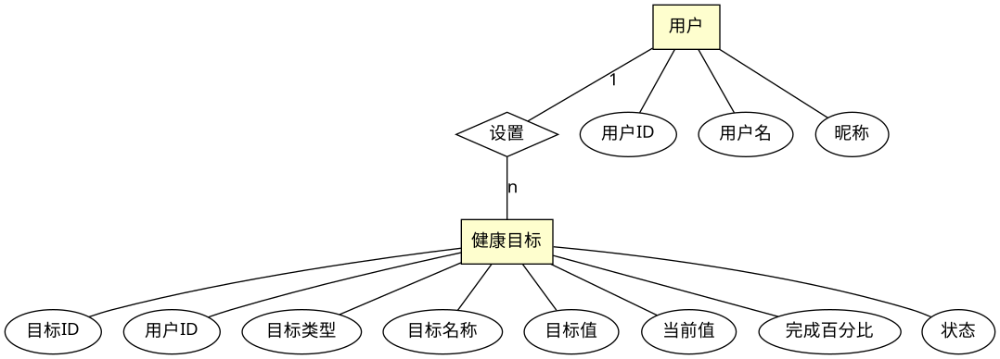

---

## 图3.19 用户与饮食打卡关系E-R图

```plantuml
@startdot
graph ER {
    fontname="Microsoft YaHei"; bgcolor="#FFFFFF";
    node [fontname="Microsoft YaHei"];
    edge [fontname="Microsoft YaHei"];

    node [shape=box, style=filled, fillcolor="#FEFECE"] user [label="用户"]; checkin [label="饮食打卡"];
    node [shape=diamond, style=filled, fillcolor="#FFFFFF"] rel [label="记录"];

    node [shape=ellipse, style="", fillcolor="#FFFFFF"]
    u1 [label="用户ID"]; u2 [label="用户名"]; u3 [label="昵称"];

    c1 [label="打卡ID"]; c2 [label="用户ID"]; c3 [label="打卡日期"];
    c4 [label="饮食摘要"]; c5 [label="总热量"]; c6 [label="心情"];
    c7 [label="打卡心得"];

    user -- u1; user -- u2; user -- u3;
    checkin -- c1; checkin -- c2; checkin -- c3;
    checkin -- c4; checkin -- c5; checkin -- c6;
    checkin -- c7;

    user -- rel [label="1"]; rel -- checkin [label="n"];
}
@enddot
```

---

## 图3.20 管理员与食物信息关系E-R图

```plantuml
@startdot
graph ER {
    fontname="Microsoft YaHei"; bgcolor="#FFFFFF";
    node [fontname="Microsoft YaHei"];
    edge [fontname="Microsoft YaHei"];

    node [shape=box, style=filled, fillcolor="#FEFECE"] admin [label="管理员"]; food [label="食物信息"];
    node [shape=diamond, style=filled, fillcolor="#FFFFFF"] rel [label="管理"];

    node [shape=ellipse, style="", fillcolor="#FFFFFF"]
    a1 [label="用户ID"]; a2 [label="用户名"]; a3 [label="密码"]; a4 [label="角色权限"];

    f1 [label="食物ID"]; f2 [label="食物名称"]; f3 [label="分类ID"];
    f4 [label="食物编码"]; f5 [label="计量单位"]; f6 [label="状态"];
    f7 [label="创建者"]; f8 [label="创建时间"];

    admin -- a1; admin -- a2; admin -- a3; admin -- a4;
    food -- f1; food -- f2; food -- f3;
    food -- f4; food -- f5; food -- f6;
    food -- f7; food -- f8;

    admin -- rel [label="1"]; rel -- food [label="n"];
}
@enddot
```

---

## 图3.12 饮食社区互动流程图

```plantuml
@startuml
skinparam defaultFontName Microsoft YaHei
start
:进入社区页面;
:拉取最新动态列表;
:浏览动态内容;

if (是否发布动态?) then (是)
    :填写文字内容;
    if (内容是否为空?) then (是)
        :提示"内容不能为空";
    else (否)
        :写入社区动态表;
        :列表刷新显示新动态;
    endif
else (否)
    if (是否进行点赞?) then (是)
        :查询点赞关联表;
        if (是否已点赞?) then (是)
            :删除点赞记录;
            :点赞数减1;
        else (否)
            :新增点赞记录;
            :点赞数加1;
        endif
    else (否)
        :输入评论内容;
        :写入评论关联表;
        :更新评论计数;
        :评论列表刷新;
    endif
endif
stop
@enduml
```

---

## 图3.13 健康雷达周报生成流程图

```plantuml
@startuml
skinparam defaultFontName Microsoft YaHei
start
:进入健康雷达周报页面;
:调用后端周报接口;
:从饮食记录表聚合近7天数据;
note right
  聚合维度:
  热量、蛋白质、
  碳水、脂肪
end note
:根据评分规则计算六维度得分;
note right
  碳水结构 / 脂肪控量
  蛋白达标 / 维生素
  水分代谢 / 饮食规律
end note
:返回评分数据给前端;
:前端通过ECharts渲染雷达图;
:展示多维度评分雷达图;
stop
@enduml
```

---

## 图3.22 用户与社区动态关系E-R图

```plantuml
@startdot
graph ER {
    fontname="Microsoft YaHei"; bgcolor="#FFFFFF";
    node [fontname="Microsoft YaHei"];
    edge [fontname="Microsoft YaHei"];

    node [shape=box, style=filled, fillcolor="#FEFECE"] user [label="用户"]; post [label="社区动态"];
    node [shape=diamond, style=filled, fillcolor="#FFFFFF"] rel [label="发布"];

    node [shape=ellipse, style="", fillcolor="#FFFFFF"]
    u1 [label="用户ID"]; u2 [label="用户名"]; u3 [label="昵称"];

    p1 [label="动态ID"]; p2 [label="用户ID"]; p3 [label="正文内容"];
    p4 [label="图片链接"]; p5 [label="点赞数"]; p6 [label="评论数"];
    p7 [label="创建时间"];

    user -- u1; user -- u2; user -- u3;
    post -- p1; post -- p2; post -- p3;
    post -- p4; post -- p5; post -- p6;
    post -- p7;

    user -- rel [label="1"]; rel -- post [label="n"];
}
@enddot
```

---

## 图3.23 管理员与科普资讯关系E-R图

```plantuml
@startdot
graph ER {
    fontname="Microsoft YaHei"; bgcolor="#FFFFFF";
    node [fontname="Microsoft YaHei"];
    edge [fontname="Microsoft YaHei"];

    node [shape=box, style=filled, fillcolor="#FEFECE"] admin [label="管理员"]; article [label="科普资讯"];
    node [shape=diamond, style=filled, fillcolor="#FFFFFF"] rel [label="发布"];

    node [shape=ellipse, style="", fillcolor="#FFFFFF"]
    a1 [label="用户ID"]; a2 [label="用户名"]; a3 [label="角色权限"];

    ar1 [label="文章ID"]; ar2 [label="标题"]; ar3 [label="作者"];
    ar4 [label="封面图"]; ar5 [label="正文内容"]; ar6 [label="浏览次数"];
    ar7 [label="发布状态"]; ar8 [label="创建时间"];

    admin -- a1; admin -- a2; admin -- a3;
    article -- ar1; article -- ar2; article -- ar3;
    article -- ar4; article -- ar5; article -- ar6;
    article -- ar7; article -- ar8;

    admin -- rel [label="1"]; rel -- article [label="n"];
}
@enddot
```

---

## 图3.24 用户与收藏记录关系E-R图

```plantuml
@startdot
graph ER {
    fontname="Microsoft YaHei"; bgcolor="#FFFFFF";
    node [fontname="Microsoft YaHei"];
    edge [fontname="Microsoft YaHei"];

    node [shape=box, style=filled, fillcolor="#FEFECE"] user [label="用户"]; fav [label="收藏记录"];
    node [shape=diamond, style=filled, fillcolor="#FFFFFF"] rel [label="收藏"];

    node [shape=ellipse, style="", fillcolor="#FFFFFF"]
    u1 [label="用户ID"]; u2 [label="用户名"]; u3 [label="昵称"];

    f1 [label="收藏ID"]; f2 [label="用户ID"]; f3 [label="收藏类型"];
    f4 [label="目标ID"]; f5 [label="目标名称"]; f6 [label="创建时间"];

    user -- u1; user -- u2; user -- u3;
    fav -- f1; fav -- f2; fav -- f3;
    fav -- f4; fav -- f5; fav -- f6;

    user -- rel [label="1"]; rel -- fav [label="n"];
}
@enddot
```

---

## 图3.25 系统总体E-R图（更新版）

```plantuml
@startuml
skinparam defaultFontSize 12
skinparam linetype ortho
skinparam rectangle {
  BackgroundColor #FEFECE
  BorderColor #A80036
  FontStyle bold
}
skinparam entity {
  BackgroundColor #DDEEFF
  BorderColor #336699
}

entity "用户" as user {
}
entity "健康档案" as health {
}
entity "饮食记录" as record {
}
entity "食物信息" as food {
}
entity "食物分类" as cat {
}
entity "营养信息" as nut {
}
entity "推荐记录" as rec {
}
entity "健康目标" as goal {
}
entity "饮食打卡" as checkin {
}
entity "管理员" as admin {
}
entity "社区动态" as post {
}
entity "科普资讯" as article {
}
entity "收藏记录" as fav {
}

user ||--o{ health : "拥有"
user ||--o{ record : "产生"
record }o--|| food : "关联"
cat ||--o{ food : "包含"
food ||--|| nut : "对应"
user ||--o{ rec : "获得"
user ||--o{ goal : "设置"
user ||--o{ checkin : "记录"
user ||--o{ post : "发布"
user ||--o{ fav : "收藏"
admin ||--o{ food : "管理"
admin ||--o{ article : "发布"
@enduml
```

---

## ========== 3.4.1 独立实体属性图（不含关系，每个实体单独一张） ==========

> 以下是老师要求的"独立实体属性图"，每张图只展示一个实体及其全部属性，不建立任何实体间关系。用于论文3.4.1节。

---

### (1) 系统用户实体属性图

```plantuml
@startdot
graph {
    fontname="Microsoft YaHei"; bgcolor="#FFFFFF"; layout=neato;
    node [fontname="Microsoft YaHei"];
    edge [len=1.8];

    node [shape=box, style=filled, fillcolor="#FEFECE", width=1.2]
    e [label="系统用户"];

    node [shape=ellipse, style="", fillcolor="#FFFFFF", width=0.8]
    a1 [label=<<U>用户ID</U>>]; a2 [label="用户名"]; a3 [label="密码"];
    a4 [label="昵称"]; a5 [label="邮箱"]; a6 [label="手机号"];
    a7 [label="性别"]; a8 [label="头像"]; a9 [label="状态"];
    a10 [label="创建时间"];

    e -- a1; e -- a2; e -- a3;
    e -- a4; e -- a5; e -- a6;
    e -- a7; e -- a8; e -- a9;
    e -- a10;
}
@enddot
```

---

### (2) 用户健康档案实体属性图

```plantuml
@startdot
graph {
    fontname="Microsoft YaHei"; bgcolor="#FFFFFF"; layout=neato;
    node [fontname="Microsoft YaHei"];
    edge [len=1.8];

    node [shape=box, style=filled, fillcolor="#FEFECE", width=1.5]
    e [label="用户健康档案"];

    node [shape=ellipse, style="", fillcolor="#FFFFFF", width=0.8]
    a1 [label=<<U>档案ID</U>>]; a2 [label="用户ID"]; a3 [label="身高"];
    a4 [label="体重"]; a5 [label="年龄"]; a6 [label="目标体重"];
    a7 [label="基础代谢率"]; a8 [label="每日推荐摄入热量"];
    a9 [label="是否糖尿病"]; a10 [label="是否高血压"];
    a11 [label="是否痛风"]; a12 [label="是否高血脂"];
    a13 [label="创建时间"]; a14 [label="更新时间"];

    e -- a1; e -- a2; e -- a3;
    e -- a4; e -- a5; e -- a6;
    e -- a7; e -- a8; e -- a9;
    e -- a10; e -- a11; e -- a12;
    e -- a13; e -- a14;
}
@enddot
```

---

### (3) 食物分类实体属性图

```plantuml
@startdot
graph {
    fontname="Microsoft YaHei"; bgcolor="#FFFFFF"; layout=neato;
    node [fontname="Microsoft YaHei"];
    edge [len=1.8];

    node [shape=box, style=filled, fillcolor="#FEFECE", width=1.2]
    e [label="食物分类"];

    node [shape=ellipse, style="", fillcolor="#FFFFFF", width=0.8]
    a1 [label=<<U>分类ID</U>>]; a2 [label="分类名称"]; a3 [label="排序号"];
    a4 [label="创建时间"];

    e -- a1; e -- a2; e -- a3;
    e -- a4;
}
@enddot
```

---

### (4) 食物信息实体属性图

```plantuml
@startdot
graph {
    fontname="Microsoft YaHei"; bgcolor="#FFFFFF"; layout=neato;
    node [fontname="Microsoft YaHei"];
    edge [len=1.8];

    node [shape=box, style=filled, fillcolor="#FEFECE", width=1.2]
    e [label="食物信息"];

    node [shape=ellipse, style="", fillcolor="#FFFFFF", width=0.8]
    a1 [label=<<U>食物ID</U>>]; a2 [label="食物名称"]; a3 [label="分类ID"];
    a4 [label="每百克热量"]; a5 [label="蛋白质"]; a6 [label="脂肪"];
    a7 [label="碳水化合物"]; a8 [label="升糖指数"]; a9 [label="嘌呤含量"];
    a10 [label="钠含量"]; a11 [label="胆固醇"]; a12 [label="数据来源"];
    a13 [label="创建时间"];

    e -- a1; e -- a2; e -- a3;
    e -- a4; e -- a5; e -- a6;
    e -- a7; e -- a8; e -- a9;
    e -- a10; e -- a11; e -- a12;
    e -- a13;
}
@enddot
```

---

### (5) 食物营养信息实体属性图

```plantuml
@startdot
graph {
    fontname="Microsoft YaHei"; bgcolor="#FFFFFF"; layout=neato;
    node [fontname="Microsoft YaHei"];
    edge [len=1.8];

    node [shape=box, style=filled, fillcolor="#FEFECE", width=1.5]
    e [label="食物营养信息"];

    node [shape=ellipse, style="", fillcolor="#FFFFFF", width=0.8]
    a1 [label=<<U>营养ID</U>>]; a2 [label="食物ID"]; a3 [label="热量"];
    a4 [label="蛋白质"]; a5 [label="脂肪"]; a6 [label="碳水化合物"];
    a7 [label="膳食纤维"]; a8 [label="钠"]; a9 [label="胆固醇"];

    e -- a1; e -- a2; e -- a3;
    e -- a4; e -- a5; e -- a6;
    e -- a7; e -- a8; e -- a9;
}
@enddot
```

---

### (6) 饮食记录实体属性图

```plantuml
@startdot
graph {
    fontname="Microsoft YaHei"; bgcolor="#FFFFFF"; layout=neato;
    node [fontname="Microsoft YaHei"];
    edge [len=1.8];

    node [shape=box, style=filled, fillcolor="#FEFECE", width=1.2]
    e [label="饮食记录"];

    node [shape=ellipse, style="", fillcolor="#FFFFFF", width=0.8]
    a1 [label=<<U>记录ID</U>>]; a2 [label="用户ID"]; a3 [label="食物ID"];
    a4 [label="就餐时段"]; a5 [label="摄入克重"]; a6 [label="摄入热量"];
    a7 [label="记录日期"]; a8 [label="创建时间"];

    e -- a1; e -- a2; e -- a3;
    e -- a4; e -- a5; e -- a6;
    e -- a7; e -- a8;
}
@enddot
```

---

### (7) 推荐记录实体属性图

```plantuml
@startdot
graph {
    fontname="Microsoft YaHei"; bgcolor="#FFFFFF"; layout=neato;
    node [fontname="Microsoft YaHei"];
    edge [len=1.8];

    node [shape=box, style=filled, fillcolor="#FEFECE", width=1.2]
    e [label="推荐记录"];

    node [shape=ellipse, style="", fillcolor="#FFFFFF", width=0.8]
    a1 [label=<<U>推荐ID</U>>]; a2 [label="用户ID"]; a3 [label="推荐食物列表"];
    a4 [label="算法类型"]; a5 [label="是否被采纳"]; a6 [label="创建时间"];

    e -- a1; e -- a2; e -- a3;
    e -- a4; e -- a5; e -- a6;
}
@enddot
```

---

### (8) 健康目标实体属性图

```plantuml
@startdot
graph {
    fontname="Microsoft YaHei"; bgcolor="#FFFFFF"; layout=neato;
    node [fontname="Microsoft YaHei"];
    edge [len=1.8];

    node [shape=box, style=filled, fillcolor="#FEFECE", width=1.2]
    e [label="健康目标"];

    node [shape=ellipse, style="", fillcolor="#FFFFFF", width=0.8]
    a1 [label=<<U>目标ID</U>>]; a2 [label="用户ID"]; a3 [label="目标类型"];
    a4 [label="目标名称"]; a5 [label="目标值"]; a6 [label="当前值"];
    a7 [label="完成百分比"]; a8 [label="状态"]; a9 [label="创建时间"];

    e -- a1; e -- a2; e -- a3;
    e -- a4; e -- a5; e -- a6;
    e -- a7; e -- a8; e -- a9;
}
@enddot
```

---

### (9) 饮食打卡实体属性图

```plantuml
@startdot
graph {
    fontname="Microsoft YaHei"; bgcolor="#FFFFFF"; layout=neato;
    node [fontname="Microsoft YaHei"];
    edge [len=1.8];

    node [shape=box, style=filled, fillcolor="#FEFECE", width=1.2]
    e [label="饮食打卡"];

    node [shape=ellipse, style="", fillcolor="#FFFFFF", width=0.8]
    a1 [label=<<U>打卡ID</U>>]; a2 [label="用户ID"]; a3 [label="打卡日期"];
    a4 [label="饮食摘要"]; a5 [label="总热量"]; a6 [label="心情"];
    a7 [label="打卡心得"]; a8 [label="创建时间"];

    e -- a1; e -- a2; e -- a3;
    e -- a4; e -- a5; e -- a6;
    e -- a7; e -- a8;
}
@enddot
```

---

### (10) 社区动态实体属性图

```plantuml
@startdot
graph {
    fontname="Microsoft YaHei"; bgcolor="#FFFFFF"; layout=neato;
    node [fontname="Microsoft YaHei"];
    edge [len=1.8];

    node [shape=box, style=filled, fillcolor="#FEFECE", width=1.2]
    e [label="社区动态"];

    node [shape=ellipse, style="", fillcolor="#FFFFFF", width=0.8]
    a1 [label=<<U>动态ID</U>>]; a2 [label="用户ID"]; a3 [label="正文内容"];
    a4 [label="图片链接"]; a5 [label="点赞数"]; a6 [label="评论数"];
    a7 [label="删除标记"]; a8 [label="创建时间"];

    e -- a1; e -- a2; e -- a3;
    e -- a4; e -- a5; e -- a6;
    e -- a7; e -- a8;
}
@enddot
```

---

### (11) 科普资讯实体属性图

```plantuml
@startdot
graph {
    fontname="Microsoft YaHei"; bgcolor="#FFFFFF"; layout=neato;
    node [fontname="Microsoft YaHei"];
    edge [len=1.8];

    node [shape=box, style=filled, fillcolor="#FEFECE", width=1.2]
    e [label="科普资讯"];

    node [shape=ellipse, style="", fillcolor="#FFFFFF", width=0.8]
    a1 [label=<<U>文章ID</U>>]; a2 [label="标题"]; a3 [label="作者"];
    a4 [label="封面图"]; a5 [label="正文内容"]; a6 [label="浏览次数"];
    a7 [label="发布状态"]; a8 [label="创建时间"];

    e -- a1; e -- a2; e -- a3;
    e -- a4; e -- a5; e -- a6;
    e -- a7; e -- a8;
}
@enddot
```

---

### (12) 收藏记录实体属性图

```plantuml
@startdot
graph {
    fontname="Microsoft YaHei"; bgcolor="#FFFFFF"; layout=neato;
    node [fontname="Microsoft YaHei"];
    edge [len=1.8];

    node [shape=box, style=filled, fillcolor="#FEFECE", width=1.2]
    e [label="收藏记录"];

    node [shape=ellipse, style="", fillcolor="#FFFFFF", width=0.8]
    a1 [label=<<U>收藏ID</U>>]; a2 [label="用户ID"]; a3 [label="收藏类型"];
    a4 [label="目标ID"]; a5 [label="目标名称"]; a6 [label="目标描述"];
    a7 [label="创建时间"];

    e -- a1; e -- a2; e -- a3;
    e -- a4; e -- a5; e -- a6;
    e -- a7;
}
@enddot
```

---

### (13) 管理员实体属性图

```plantuml
@startdot
graph {
    fontname="Microsoft YaHei"; bgcolor="#FFFFFF"; layout=neato;
    node [fontname="Microsoft YaHei"];
    edge [len=1.8];

    node [shape=box, style=filled, fillcolor="#FEFECE", width=1.2]
    e [label="管理员"];

    node [shape=ellipse, style="", fillcolor="#FFFFFF", width=0.8]
    a1 [label=<<U>用户ID</U>>]; a2 [label="用户名"]; a3 [label="登录密码"];
    a4 [label="昵称"]; a5 [label="角色权限"]; a6 [label="手机号"];
    a7 [label="状态"]; a8 [label="创建时间"];

    e -- a1; e -- a2; e -- a3;
    e -- a4; e -- a5; e -- a6;
    e -- a7; e -- a8;
}
@enddot
```

---

## 图3.21 系统总体E-R图

```plantuml
@startdot
graph ER {
    fontname="SimSun"; bgcolor="#FFFFFF"; layout=neato; overlap=false; splines=true;
    node [fontname="SimSun"];
    edge [fontname="SimSun", len=2.0];

    node [shape=box, style=filled, fillcolor="#FEFECE"] 
    user [label="用户"]; health [label="健康档案"]; goal [label="健康目标"];
    record [label="饮食记录"]; rec [label="推荐记录"]; checkin [label="饮食打卡"];
    post [label="社区动态"]; fav [label="收藏记录"]; admin [label="管理员"];
    cat [label="食物分类"]; food [label="食物信息"]; nut [label="营养信息"];
    art [label="科普资讯"];

    node [shape=diamond, style=filled, fillcolor="#FFFFFF"]
    r_has [label="拥有"]; r_set [label="设定"]; r_prod [label="产生"];
    r_get [label="获取"]; r_log [label="记录"]; r_pub [label="发布"];
    r_fav [label="收藏"]; r_inc [label="包含"]; r_ref [label="对应"]; 
    r_rec_f [label="关联"]; r_admin [label="管理"];

    user -- r_has [label="1"]; r_has -- health [label="1"];
    user -- r_set [label="1"]; r_set -- goal [label="n"];
    user -- r_prod [label="1"]; r_prod -- record [label="n"];
    user -- r_get [label="1"]; r_get -- rec [label="n"];
    user -- r_log [label="1"]; r_log -- checkin [label="n"];
    user -- r_pub [label="1"]; r_pub -- post [label="n"];
    user -- r_fav [label="1"]; r_fav -- fav [label="n"];

    cat -- r_inc [label="1"]; r_inc -- food [label="n"];
    food -- r_ref [label="1"]; r_ref -- nut [label="1"];
    record -- r_rec_f [label="n"]; r_rec_f -- food [label="1"];
    
    admin -- r_admin [label="1"]; 
    r_admin -- cat [label="n"];
    r_admin -- food [label="n"];
    r_admin -- art [label="n"];
    r_admin -- user [label="n"];
}
@enddot
```

---

## 使用说明

1. 打开 https://www.plantuml.com/plantuml/uml/
2. 将上方某段 `@startdot ... @enddot` 或 `@startuml ... @enduml` 之间的代码复制粘贴进去
3. 点击 **Submit** 生成图片
4. 右键保存PNG图片
5. 在Word中"插入图片"即可

> **提示**：如果中文显示为方块，在代码开头加一行 `skinparam defaultFontName SimSun` 替换字体。
> 
> **属性图使用说明**：属性图使用 Graphviz DOT 的 `neato` 布局引擎，会自动将椭圆属性节点均匀散布在中心实体方框四周，生成的图片即为标准的"独立实体属性图"。

